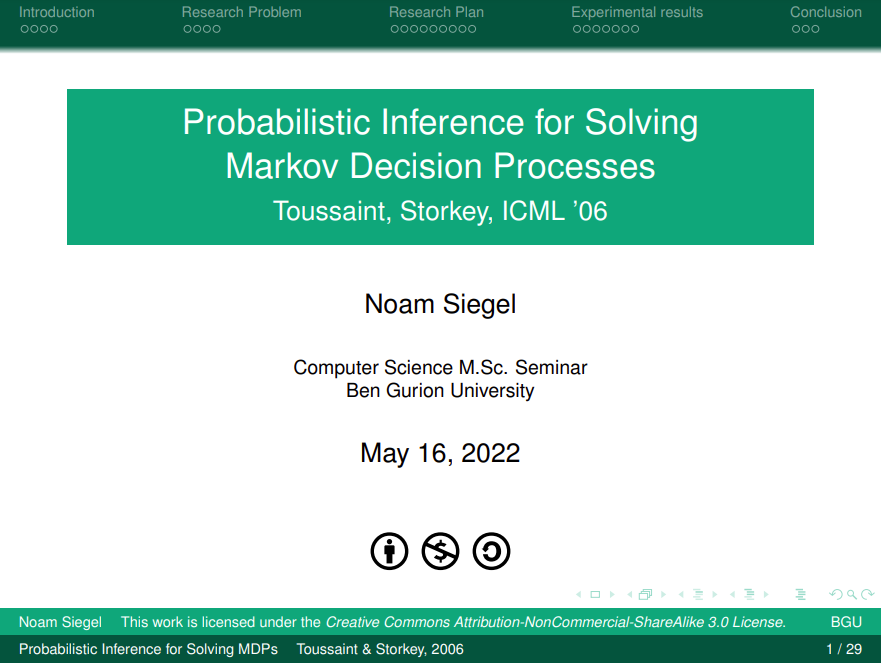

# [Toussaint-Storkey-06] Beamer Presentation

This repository hosts source code for my presentation slides about the paper:

```
Toussaint, Marc, and Amos Storkey.
"Probabilistic inference for solving discrete and continuous state Markov Decision Processes."
Proceedings of the 23rd international conference on Machine learning. 2006.
```

Please enjoy the free use of this material subject to the Creative Commons Attribution-NonCommercial-ShareAlike 3.0 License.


## Authors

- [@noamsgl](https://www.github.com/noamsgl)


## License


 [![CC BY-NC-SA 3.0][cc-by-nc-sa-shield]][cc-by-nc-sa]

This work is licensed under a
[Creative Commons Attribution-NonCommercial-ShareAlike 3.0 International License][cc-by-nc-sa].

[![CC BY-NC-SA 3.0][cc-by-nc-sa-image]][cc-by-nc-sa]

[cc-by-nc-sa]: http://creativecommons.org/licenses/by-nc-sa/3.0/
[cc-by-nc-sa-image]: https://licensebuttons.net/l/by-nc-sa/3.0/88x31.png
[cc-by-nc-sa-shield]: https://img.shields.io/badge/License-CC%20BY--NC--SA%203.0-lightgrey.svg
## Screenshots



